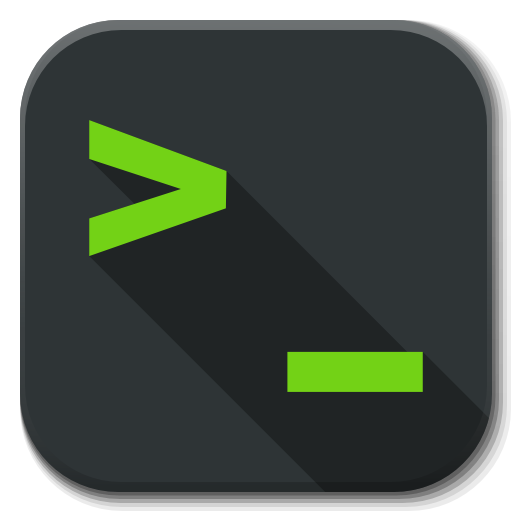
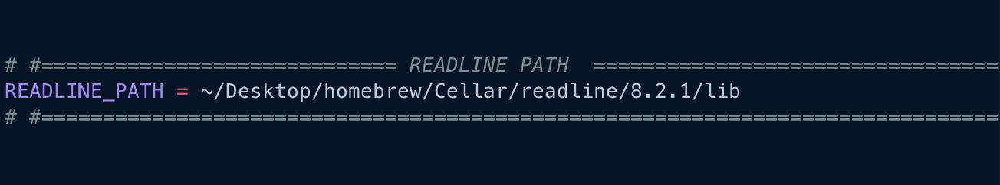
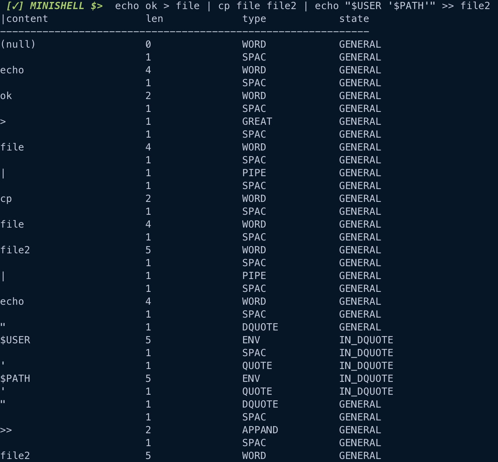
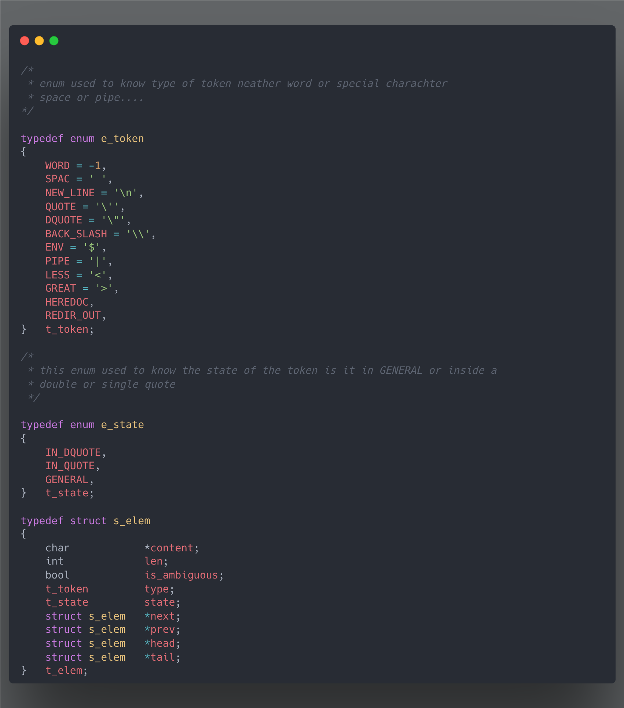
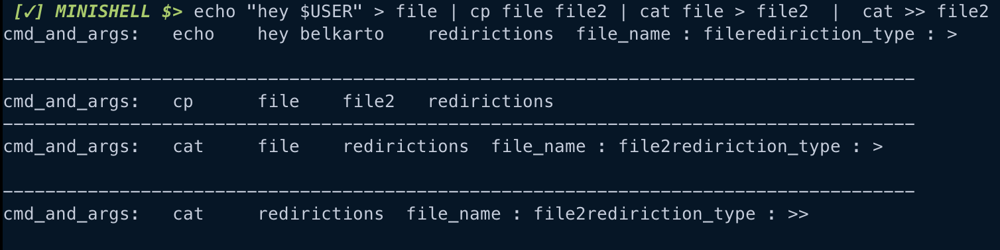
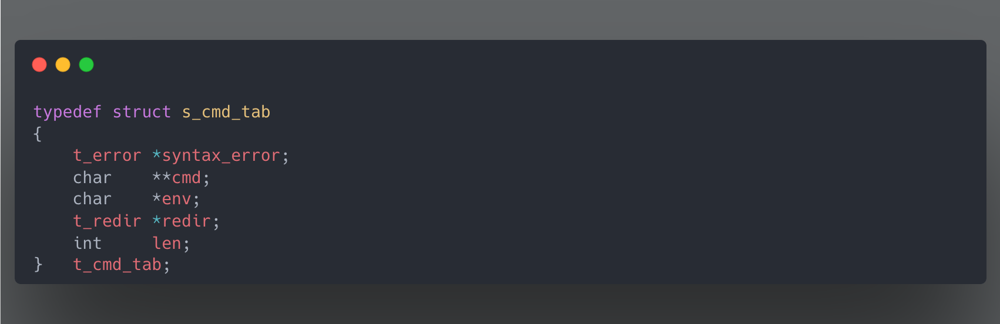

<style>
.bullet {
    color: #34495E;
    font-family: Courier New;
}
</style>

# <span style="color: #596666;">**Minishell**</span> 

## <span style="color: Grey;">*Description*</span>
<p align="center">
	
	
	
	
	
</p>

<center> <font face="Courier New" size="2"> This project is a simple shell written in C that provides a basic command-line interface. <br> <br> </font>


</center>

<i>
<ul>
    <li class="bullet"> <a href="#history"> History</li> </a>
    <li class="bullet"> <a href="#installation"> Installation</li> </a>
    <li class="bullet"> <a href="#features"> Features</li> </a>
    <li class="bullet"> <a href="#lexer && parsing"> Lexer && Parsing</li> </a>
    <li class="bullet"> <a href="#execution"> Execution</li> </a>
    <li class="bullet"> <a href="#resources"> Resources</li> </a>
</ul>
</i>

## <span style="color: Grey;" id="history">*History*</span>

<div style="float: right; margin-left: 30px;">
    
</div>
<div style="border: #626567; background-color: #17202A; padding: 10px;">
    <font face="Times New Roman" size="3"> <span style="color: #85929E ;"> In its earliest form, a terminal was a small machine consisting of a monitor and a keyboard that allowed people to communicate with a larger computer system. <br>
    The terminal continued to improve and eventually led to the creation of the Bash shell. Bash is now one of the most widely used shells on Unix-based operating systems and is the default shell on most Linux distributions. <br><br>
    <b>
    So how can we create a small version of if using C programming language ?
    <a href="https://www.youtube.com/watch?v=-u9F4O730RE">More</a> </span> </font>
</div>

<br>

## <span style="color: Grey;" id="installation">*Installation*</span>

 <p style="font-family: Times New Roman ;color: #807070">1 - Clone this repository:</p>

 ```
 git clone https://github.com/belkarto/minishell.git
 ```
<p style="font-family: Times New Roman ;color: #807070">2 - Add readline path to Makefile:</p>




 <b><i><p style="color: #DBDBFF" >&nbsp;&nbsp;&nbsp;NOTE :</p></b></i>
 
<p style="font-family: Times New Roman ;color: #807070">
 &nbsp;&nbsp;&nbsp;If you do not have readline, you can install it by using:
</p>

 ```
 brew install readline
 ```

<br> 

## <span style="color: Grey;" id="features">*Features*</span>
<style>
input[type="checkbox"] + label {
    color: #515A5A;
    font-family: Times New Roman;
}
</style>

- [x] <label> Command Parsing </label>
- [x] <label> Command Search && Execution </label>
- [x] <label> Input/Output Redirection </label>
- [x] <label> Pipe Execution </label>
- [x] <label> Variable Expansion </label>


## <span style="color: Grey;" id="lexer && parsing">*Lexer && Parsing*</span>

### <span style="color: #5A7777;">**&nbsp;&nbsp;&nbsp;&nbsp;&nbsp;&nbsp;&nbsp;Lexer**</span>

<div style="border: #626567; background-color: #17202A; padding: 10px;">
    <font face="Trebuchet MS" size="3"> <span style="color: #85929E ;">
    The lexer takes the command line and parses it into tokens. Therefore, there are two types of tokens: <br>
    &nbsp;&nbsp;&nbsp;&nbsp;- Word <br>
    &nbsp;&nbsp;&nbsp;&nbsp;- Special characters (“, ‘, <, >, <<, >>, $, |, spc) </span> </font>
</div>

<br>
&nbsp;<details>
<summary style="list-style-type: '>';color: #EFDFF1">
    <i>
     Click for Example :
    </i>
  </summary>
    <center>
    <br>
  
    </center>
</details>

<details>
    <summary style="list-style-type: '>';color: #EFDFF1">
    <i>
        Click for Structs :
    </i>
    </summary>
    <center>
    <br>
  
    </center>
</details>

### <span style="color: #5A7777;">**&nbsp;&nbsp;&nbsp;&nbsp;&nbsp;&nbsp;&nbsp;Parser**</span>

<div style="border: #626567; background-color: #17202A; padding: 10px;">
    <font face="Trebuchet MS" size="3"> <span style="color: #85929E ;">
    The parser takes the sequences of tokens generated by the lexer, allocates a command table, puts the content of the command in the cmd_tab.cmd and saves the files in cmd_tab.redir while checking the syntax error. <br>
    The lexer and the parser work together to transform the command line into a form that can be executed.</span> </font>
    <br> <br>
    <i> Note: You can use a command table if your shell is handling only pipes, else in case of handling logical operators like "&&" or "||" the best way is to use a data structure called Abstract Syntax Tree (AST). </i>
</div>

<br>

<details>
<summary style="list-style-type: '>';color: #EFDFF1">
    <i>
     Click for Examples :
    </i>
  </summary>
    <center>
    <br>
  
    </center>
</details>

<details>
<summary style="list-style-type: '>';color: #EFDFF1">
    <i>
     Click for Struct :
    </i>
  </summary>
    <center>
    <br>
  
    </center>
</details>

## <span style="color: Grey;" id="execution">*Execution*</span>
>>>>>>> Stashed changes
